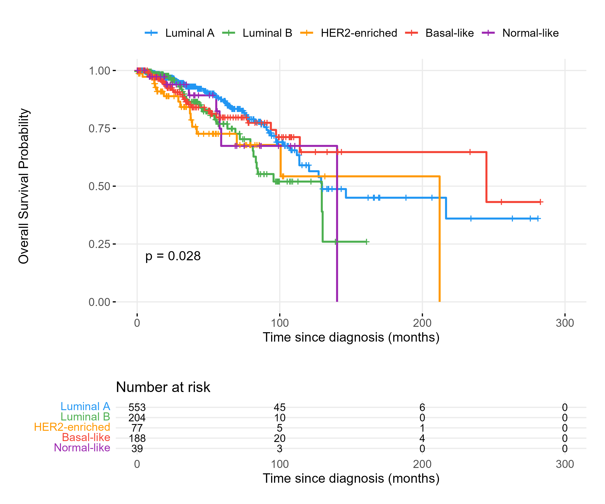
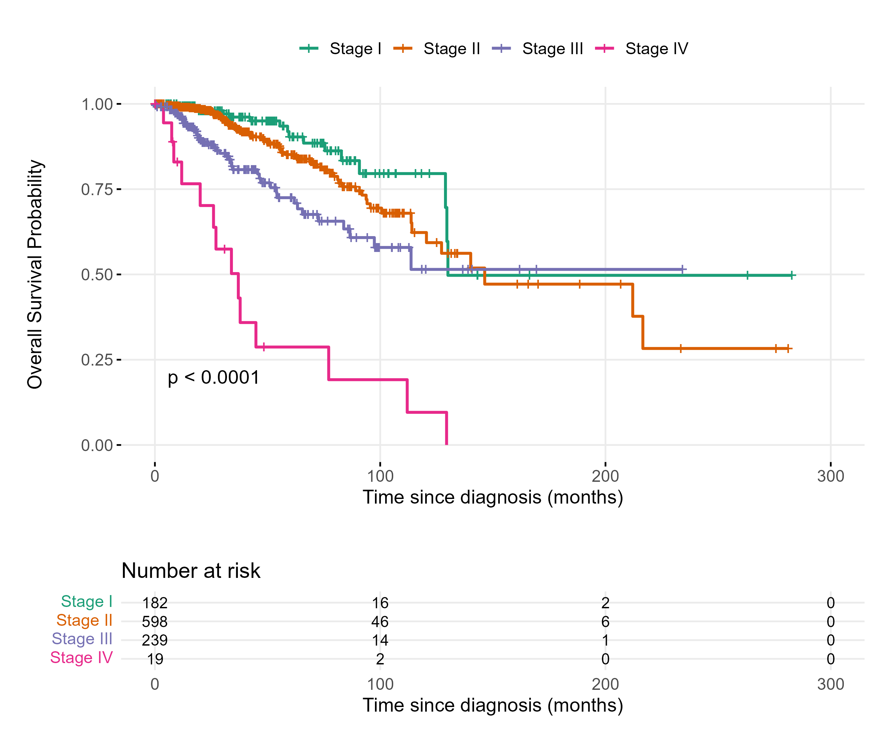
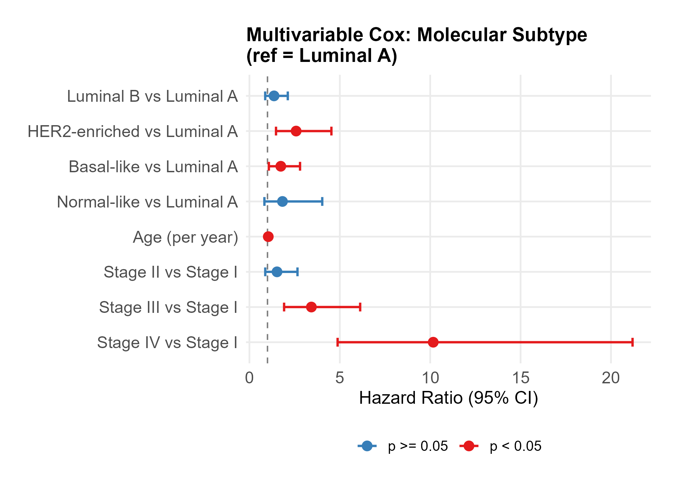
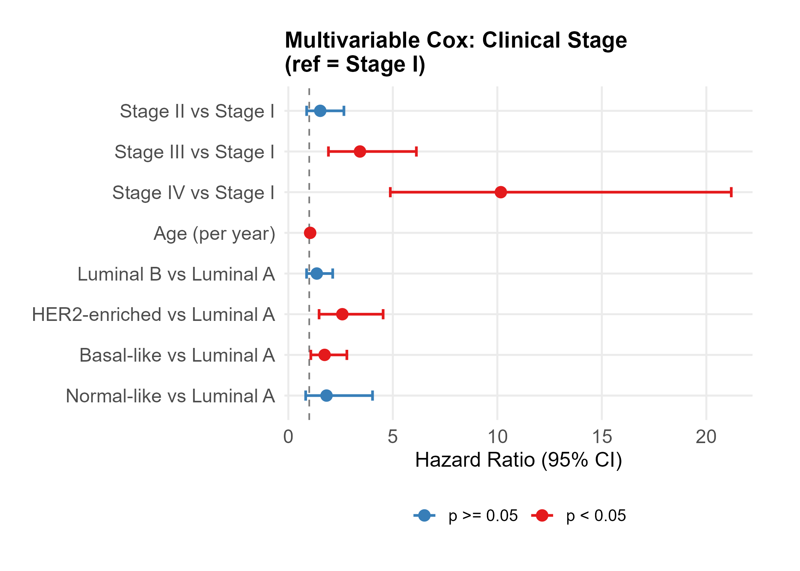
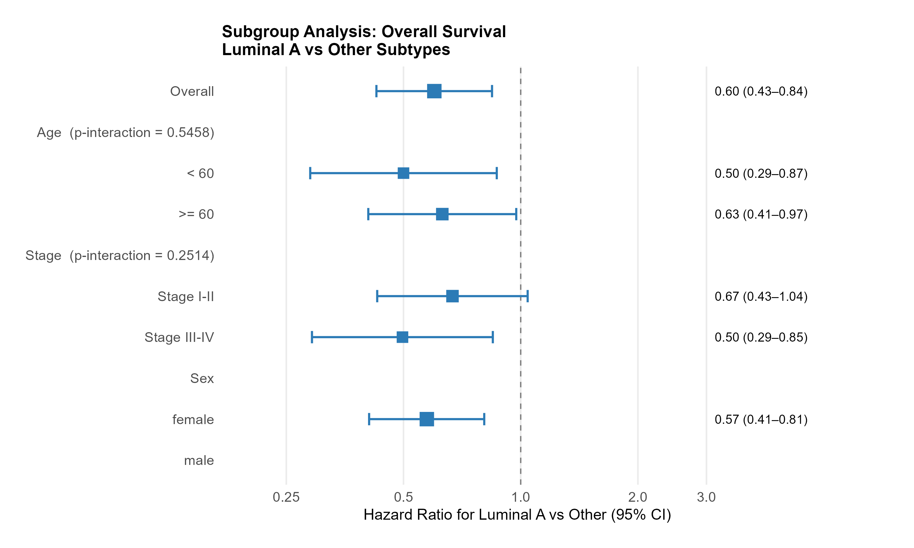

# TCGA-BRCA Overall Survival Analysis

Survival analysis of breast cancer patients from The Cancer Genome Atlas (TCGA-BRCA) using publicly available clinical and molecular subtype data. The analysis applies Kaplan-Meier estimation, multivariable Cox proportional hazards regression, and subgroup analysis to characterize how PAM50 molecular subtypes and clinical stage influence overall survival.

---

## Motivation

Molecular subtyping (PAM50) has substantially changed how breast cancer prognosis is understood, yet its relationship with survival — adjusted for stage and age — is not always presented in a reproducible, end-to-end analysis. This project demonstrates the full workflow from public data access through publication-ready figures, with a focus on statistical rigor (proportional hazards verification, interaction testing in subgroup analysis).

---

## Data Source

- **TCGA-BRCA** via the [GDC Data Portal](https://portal.gdc.cancer.gov/)
- Accessed using the `TCGAbiolinks` R package (Bioconductor)
- Clinical variables: vital status, days to death / last follow-up, age at diagnosis, AJCC pathologic stage
- Molecular subtypes: PAM50 (Luminal A, Luminal B, HER2-enriched, Basal-like, Normal-like)

> Raw data files are excluded from this repository per GDC data access guidelines. Run `analysis/01_data_download.R` to reproduce the download.

---

## Methods

### Survival Endpoint
- **Overall Survival (OS):** time from diagnosis to death (event) or last follow-up (censored), converted from days to months

### Kaplan-Meier Analysis
- Stratified by PAM50 subtype (5 groups) and clinical stage (I–IV)
- Log-rank test for group comparison

### Cox Proportional Hazards Regression
- **Model 1 (primary):** PAM50 subtype as main exposure, adjusted for age and stage (reference: Luminal A)
- **Model 2:** Clinical stage as main exposure, adjusted for age and subtype (reference: Stage I)
- Proportional hazards assumption verified via Schoenfeld residual test (`cox.zph`)

### Subgroup Analysis
- Binary exposure: Luminal A vs Other subtypes
- Subgroups: age (< 60 / ≥ 60), clinical stage (I–II / III–IV), sex
- Cox model fit within each stratum, adjusted for age
- Interaction p-values computed to assess effect modification

---

## Repository Structure

```
tcga-brca-survival/
├── analysis/
│   ├── 01_data_download.R      # Download TCGA-BRCA data via TCGAbiolinks
│   ├── 02_preprocessing.R      # Merge clinical + PAM50, define OS endpoint
│   ├── 03_km_curves.R          # Kaplan-Meier curves by subtype and stage
│   ├── 04_cox_regression.R     # Multivariable Cox models + forest plots
│   └── 05_subgroup_forest.R    # Subgroup analysis + interaction tests
├── results/                    # CSV outputs (HR tables, subgroup results)
├── plots/                      # PNG figures (300 dpi)
├── .gitignore
└── README.md
```

Scripts are designed to be run sequentially (01 → 05). Each script reads from `data/` and writes outputs to `results/` and `plots/`.

---

## Setup

```r
# Bioconductor packages
install.packages("BiocManager")
BiocManager::install("TCGAbiolinks")

# CRAN packages
install.packages(c(
  "survival", "survminer", "dplyr", "ggplot2",
  "broom", "tidyr", "scales"
))
```

R version: ≥ 4.3.0

---

## Key Results

### Kaplan-Meier Analysis

**By PAM50 subtype** (log-rank p = 0.028): Luminal A showed the most favorable long-term survival, while Luminal B declined steeply after 150 months.



**By clinical stage** (log-rank p < 0.0001): clear separation across all four stages, with Stage IV showing rapid early decline.



---

### Multivariable Cox Regression

**Model 1: PAM50 subtype** (ref = Luminal A), adjusted for age and stage:

| Comparison | HR | 95% CI | p-value |
|---|---|---|---|
| Luminal B vs Luminal A | 1.36 | 0.87–2.12 | 0.173 |
| HER2-enriched vs Luminal A | 2.58 | 1.47–4.54 | 0.001 |
| Basal-like vs Luminal A | 1.74 | 1.08–2.80 | 0.024 |
| Normal-like vs Luminal A | 1.83 | 0.83–4.03 | 0.135 |
| Age (per year) | 1.04 | 1.03–1.06 | < 0.001 |



**Model 2: Clinical stage** (ref = Stage I), adjusted for age and subtype:

| Comparison | HR | 95% CI | p-value |
|---|---|---|---|
| Stage II vs Stage I | 1.53 | 0.88–2.66 | 0.136 |
| Stage III vs Stage I | 3.43 | 1.92–6.13 | < 0.001 |
| Stage IV vs Stage I | 10.17 | 4.88–21.19 | < 0.001 |
| Age (per year) | 1.04 | 1.03–1.06 | < 0.001 |



---

### Subgroup Analysis: Luminal A vs Other

Overall HR = 0.60 (95% CI: 0.43–0.84), indicating significantly better survival for Luminal A across all subgroups examined. No significant effect modification was detected (all p-interaction > 0.05).

| Subgroup | Stratum | N | Events | HR | 95% CI | p-value | p-interaction |
|---|---|---|---|---|---|---|---|
| Age | < 60 | 559 | 57 | 0.50 | 0.29–0.87 | 0.014 | 0.546 |
| Age | ≥ 60 | 479 | 81 | 0.63 | 0.41–0.97 | 0.038 | |
| Stage | I–II | 780 | 80 | 0.67 | 0.43–1.04 | 0.076 | 0.251 |
| Stage | III–IV | 258 | 58 | 0.50 | 0.29–0.85 | 0.010 | |
| Sex | Female | 1038 | 138 | 0.57 | 0.41–0.81 | 0.001 | — |



---

## Output Figures

| File | Description |
|---|---|
| `plots/km_subtype.png` | KM curves by PAM50 subtype with log-rank p-value |
| `plots/km_stage.png` | KM curves by clinical stage (I–IV) |
| `plots/cox_forest_subtype.png` | Cox HR forest plot: subtype contrasts |
| `plots/cox_forest_stage.png` | Cox HR forest plot: stage contrasts |
| `plots/forest_subgroup.png` | Subgroup forest plot with interaction p-values |

---

## Author

**Jiyue Zhang**  
M.S. Applied Mathematics & Statistics, Johns Hopkins University (2025)  
GitHub: [jzhan96](https://github.com/jzhan96)
